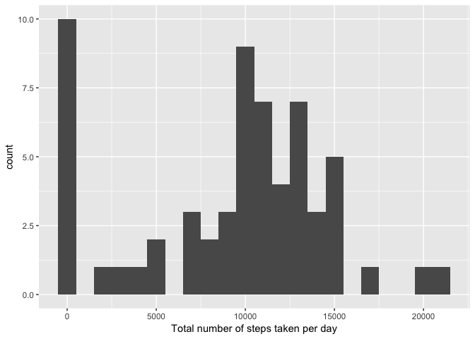
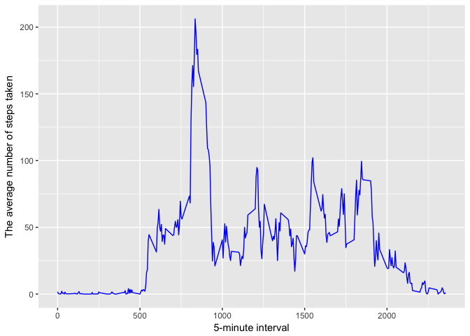
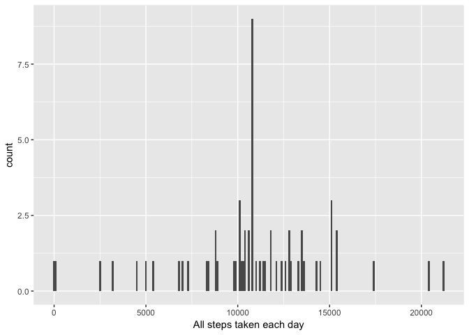
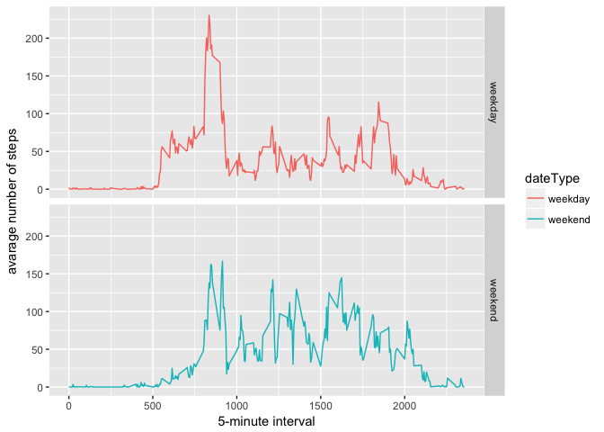

# Reproducible Research: Peer Assessment 1


## Loading and preprocessing the data

Show any code that is needed to

1. Load the data (i.e. 𝚛𝚎𝚊𝚍.𝚌𝚜𝚟())
2. Process/transform the data (if necessary) into a format suitable for your analysis

### Reading in the data
The data is loaded using the read.csv(). 

Attention: Make sure the data is download in the same working directory with the Rmarkdown file.


```r
unzip(zipfile="activity.zip")
data <- read.csv("activity.csv")
```
Quick look of data: head()


```r
head(data)
```

```
##   steps       date interval
## 1    NA 2012-10-01        0
## 2    NA 2012-10-01        5
## 3    NA 2012-10-01       10
## 4    NA 2012-10-01       15
## 5    NA 2012-10-01       20
## 6    NA 2012-10-01       25
```

Structure of data: str()


```r
str(data)
```

```
## 'data.frame':	17568 obs. of  3 variables:
##  $ steps   : int  NA NA NA NA NA NA NA NA NA NA ...
##  $ date    : Factor w/ 61 levels "2012-10-01","2012-10-02",..: 1 1 1 1 1 1 1 1 1 1 ...
##  $ interval: int  0 5 10 15 20 25 30 35 40 45 ...
```


## What is mean total number of steps taken per day?

For this part of the assignment, you can ignore the missing values in the dataset.

1. Calculate the total number of steps taken per day
2. If you do not understand the difference between a histogram and a barplot, research the difference between them. Make a histogram of the total number of steps taken each day
3. Calculate and report the mean and median of the total number of steps taken per day


```r
library(ggplot2)

total_steps <- tapply(data$steps, data$date, FUN=sum, na.rm=TRUE)
qplot(total_steps, binwidth=1000, xlab="Total number of steps taken per day")
```

<!-- -->

```r
mean(total_steps, na.rm=TRUE)
```

```
## [1] 9354.23
```

```r
median(total_steps, na.rm=TRUE)
```

```
## [1] 10395
```
## What is the average daily activity pattern?

1. Make a time series plot (i.e. 𝚝𝚢𝚙𝚎 = "𝚕") of the 5-minute interval (x-axis) and the average number of steps taken, averaged across all days (y-axis)


```r
library(ggplot2)
average <- aggregate(x=list(steps=data$steps), by=list(interval=data$interval),
                      FUN=mean, na.rm=TRUE)
ggplot(data=average, aes(x=interval, y=steps)) + geom_line(color = "blue") + xlab("5-minute interval") +
    ylab("The average number of steps taken")
```

<!-- -->

2. Which 5-minute interval, on average across all the days in the dataset, contains the maximum number of steps?


```r
mostSteps <- which.max(average$steps)
timeMostSteps <-  gsub("([0-9]{1,2})([0-9]{2})", "\\1:\\2", average[mostSteps,'interval'])

timeMostSteps
```

```
## [1] "8:35"
```

## Imputing missing values
Note that there are a number of days/intervals where there are missing values (coded as 𝙽𝙰). The presence of missing days may introduce bias into some calculations or summaries of the data.

1. Calculate and report the total number of missing values in the dataset (i.e. the total number of rows with 𝙽𝙰s)


```r
# How many missing
sum(is.na(data$steps))
```

```
## [1] 2304
```

2. Devise a strategy for filling in all of the missing values in the dataset. The strategy does not need to be sophisticated. For example, you could use the mean/median for that day, or the mean for that 5-minute interval, etc.
3. Create a new dataset that is equal to the original dataset but with the missing data filled in.


```r
all_data <- data
nas <- is.na(all_data$steps)
avg_interval <- tapply(all_data$steps, all_data$interval, mean, na.rm=TRUE, simplify=TRUE)
all_data$steps[nas] <- avg_interval[as.character(all_data$interval[nas])]
```

4. Make a histogram of the total number of steps taken each day and Calculate and report the mean and median total number of steps taken per day. Do these values differ from the estimates from the first part of the assignment? What is the impact of imputing missing data on the estimates of the total daily number of steps?


```r
all_steps <- tapply(all_data$steps, all_data$date, FUN=sum)
qplot(all_steps, binwidth=100, xlab="All steps taken each day")
```

<!-- -->

```r
mean(all_steps)
```

```
## [1] 10766.19
```

```r
median(all_steps)
```

```
## [1] 10766.19
```


## Are there differences in activity patterns between weekdays and weekends?

For this part the 𝚠𝚎𝚎𝚔𝚍𝚊𝚢𝚜() function may be of some help here. Use the dataset with the filled-in missing values for this part.

1. Create a new factor variable in the dataset with two levels – “weekday” and “weekend” indicating whether a given date is a weekday or weekend day.

```r
all_data$dateType <-  ifelse(as.POSIXlt(all_data$date)$wday %in% c(0,6), 'weekend', 'weekday')

head(all_data)
```

```
##       steps       date interval dateType
## 1 1.7169811 2012-10-01        0  weekday
## 2 0.3396226 2012-10-01        5  weekday
## 3 0.1320755 2012-10-01       10  weekday
## 4 0.1509434 2012-10-01       15  weekday
## 5 0.0754717 2012-10-01       20  weekday
## 6 2.0943396 2012-10-01       25  weekday
```


2. Make a panel plot containing a time series plot (i.e. 𝚝𝚢𝚙𝚎 = "𝚕") of the 5-minute interval (x-axis) and the average number of steps taken, averaged across all weekday days or weekend days (y-axis). See the README file in the GitHub repository to see an example of what this plot should look like using simulated data.


```r
average_data <- aggregate(steps ~ interval + dateType, data=all_data, mean)
ggplot(average_data, aes(interval, steps, color = dateType)) + 
    geom_line() + 
    facet_grid(dateType ~ .) +
    xlab("5-minute interval") + 
    ylab("avarage number of steps")
```

<!-- -->

